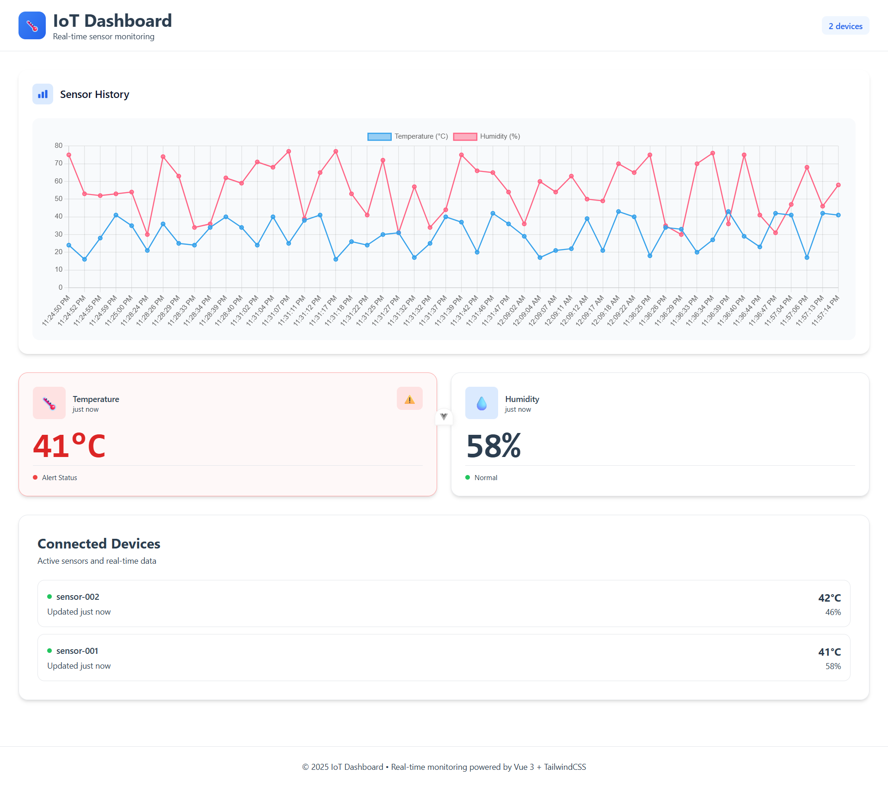

# 🌡️ IoT Real-Time Sensor Dashboard

**Express.js + MongoDB + Socket.io + Vue 3 + TailwindCSS**

A complete real-time IoT dashboard system that receives sensor data, stores it in MongoDB, displays live updates via Socket.io, and visualizes history using charts. Includes fake sensor simulation scripts.

---

## 🚀 **Project Goals**

This project demonstrates:

- Real-time data streaming using **Socket.io**
- REST API with **Express.js**
- Database storage using **MongoDB / Mongoose**
- Responsive dashboard using **Vue 3 + TailwindCSS**
- Historical charts using **Chart.js**
- Simulated IoT devices sending temperature/humidity data

---

# 🧱 **Tech Stack**

### **Backend**

- Node.js / Express
- MongoDB + Mongoose
- Socket.io (real-time)
- Morgan (logging)
- Dotenv (env config)

### **Frontend**

- Vue 3 (Composition API)
- Vite
- TailwindCSS
- Socket.io-client
- Chart.js

### **Simulation**

- Node.js scripts that send random sensor data every few seconds

---

# 📁 **Project Structure**

```
iot-dashboard/
│
├── backend/
│   ├── config/
│   │   └── db.js
│   ├── routes/
│   │   └── sensorRoutes.js
│   ├── models/
│   │   └── Sensor.js
│   ├── middlewares/
│   │   └── errorHandler.js
│   ├── simulation/
│   │   └── sensor1.js
│   ├── server.js
│   └── .env.example
│
├── frontend/
│   ├── src/
│   │   ├── views/
│   │   ├── components/
│   │   ├── services/
│   │   └── utils/
│   ├── vite.config.js
│   └── .env.example
│
└── README.md
```

---

# ⚙️ **Backend Setup**

### **1. Install dependencies**

```bash
cd backend
npm install
```

### **2. Create `.env` file**

Copy `.env.example` → `.env`:

```bash
PORT=5000
MONGO_URI=mongodb://localhost:27017/iot_dashboard
FRONTEND_URL=http://localhost:5173
```

### **3. Start backend**

```bash
npm start
```

Backend runs at:

👉 **[http://localhost:5000](http://localhost:5000)**

---

# 📡 **Frontend Setup**

### **1. Install dependencies**

```bash
cd frontend
npm install
```

### **2. Create `.env`**

Copy `.env.example` → `.env`:

```
VITE_API_URL=http://localhost:5000
VITE_SOCKET_URL=http://localhost:5000
```

### **3. Start frontend**

```bash
npm run dev
```

Frontend runs at:

👉 **[http://localhost:5173](http://localhost:5173)**

---

# 📶 **Run Sensor Simulation**

Each virtual device sends random data every 5 seconds.

Example:

```bash
cd backend/simulation
node sensor1.js
```

You can create more devices:

```
sensor1.js
sensor2.js
sensor3.js
```

Each device will appear in the dashboard device list.

---

# 📊 **Features**

### ✔ Real-time live updates (Socket.io)

### ✔ Responsive dashboard

### ✔ Temperature & humidity cards

### ✔ Per-device details (last updated & latest values)

### ✔ Historical charts (temperature/humidity over time)

### ✔ Alerts when temp > 30°C

### ✔ Fake simulation scripts

### ✔ MongoDB storage

---

# 🖼️ **Screenshots**





---

# 🧪 API Endpoints

### **POST /api/sensors**

Store new sensor reading.

### **GET /api/sensors**

Return latest 50 readings.

### **DELETE /api/sensors**

Delete all data.

---

# 🛠 Development Notes

- Socket.io keeps UI in sync with real-time data.
- `timeAgo()` auto-refreshes every second using an internal ticking ref.
- Errors are handled by a global error middleware.
- CORS allows frontend to communicate safely.

---

# 🙌 Author

Built by **Ayoub** — IoT, Full-Stack & Real-time Systems Developer.
